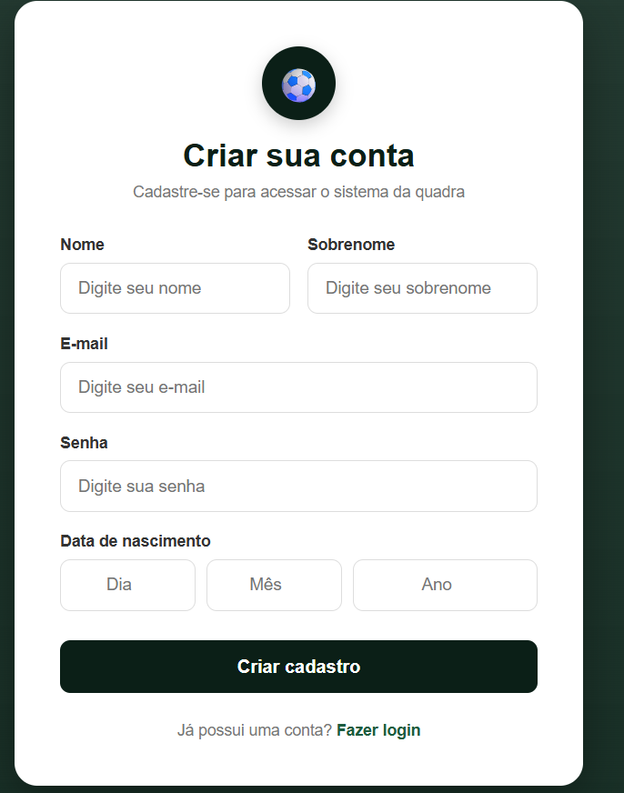
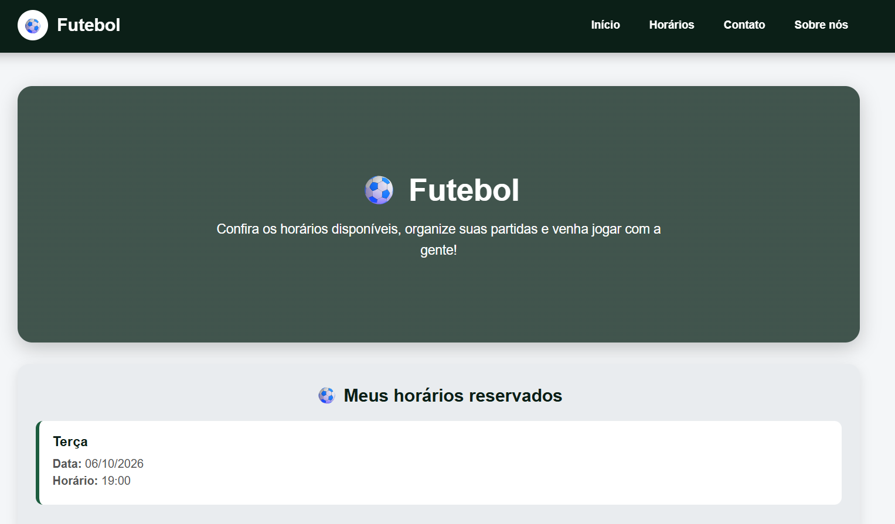
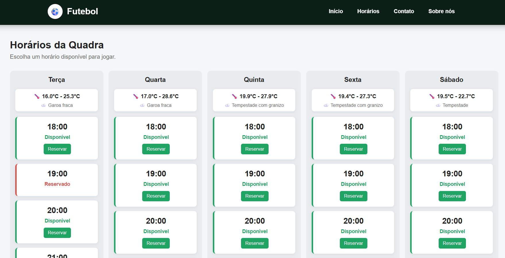
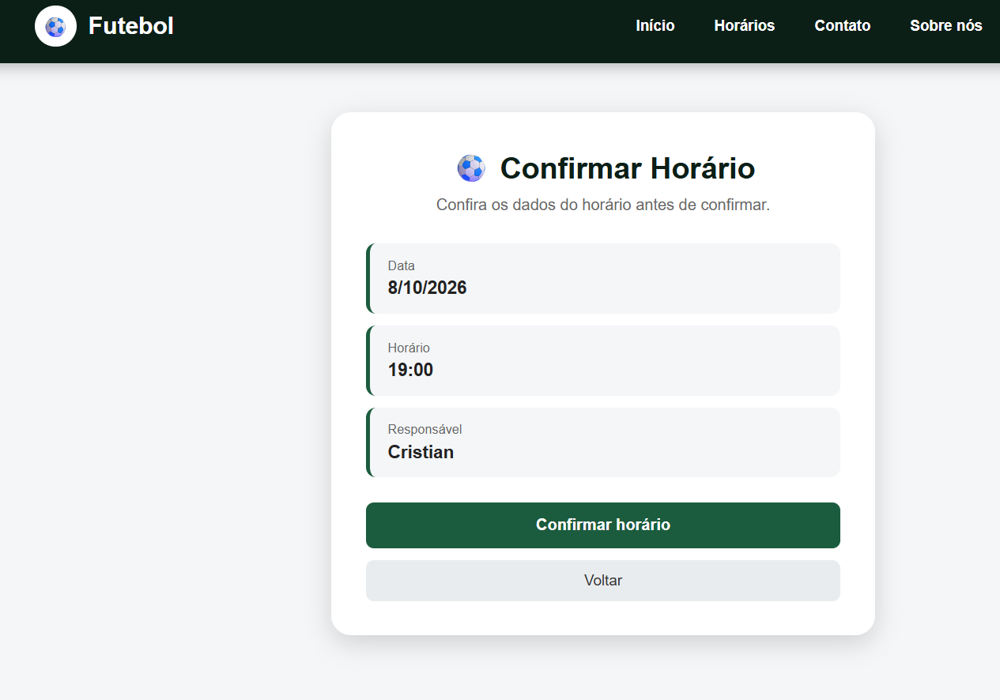

# ⚽ Sistema de Agendamento de Quadra

Sistema web desenvolvido para gerenciamento e reserva de horários de uma quadra de futebol.

O projeto foi desenvolvido utilizando Python, Flask e PostgreSQL, com o objetivo de praticar desenvolvimento web, banco de dados, autenticação de usuários e consumo de API externa.

## 📌 Sobre o projeto

A aplicação permite que usuários realizem login, consultem os horários disponíveis e façam reservas.

Os horários são organizados por dia da semana, facilitando a visualização dos períodos disponíveis.

O sistema também apresenta informações de previsão do tempo para os dias disponíveis, utilizando dados obtidos através da Open-Meteo API.

## 🚀 Funcionalidades

* Cadastro de usuários
* Login de usuários
* Autenticação utilizando sessão
* Consulta de horários disponíveis
* Organização dos horários por dia da semana
* Reserva de horários
* Identificação do responsável pela reserva
* Consulta de previsão do tempo
* Integração com PostgreSQL
* Senhas armazenadas utilizando hash com bcrypt

## 🛠️ Tecnologias utilizadas

* Python
* Flask
* Jinja2
* PostgreSQL
* bcrypt
* HTML5
* CSS3
* Open-Meteo API

## 📚 Objetivo

Este projeto foi desenvolvido durante meus estudos em Análise e Desenvolvimento de Sistemas.

O objetivo é colocar em prática conhecimentos de Python, desenvolvimento web, banco de dados, SQL e integração com APIs.

## 👨‍💻 Autor

## 📸 Demonstração

### 🔐 Tela de Login + cadastro

##  Tela inicio + reservas

### ⚽ Horários disponíveis + clima do dia

### 📅 Reserva de horário + confirmação

**Cristian Dalnei Maciel Lima**

Estudante de Análise e Desenvolvimento de Sistemas.
